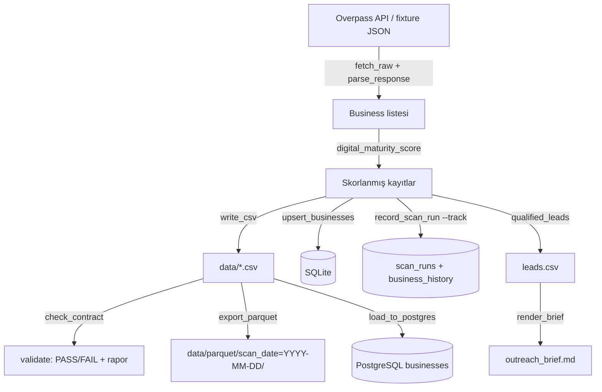

# Architecture

Bu belge, `local-market-scanner`'ın modül haritasını, veri akışını ve
tasarım kararlarını sabitler. Kod ile çeliştiği an **kod kazanır**; bu
dosya güncellenmelidir.

## Veri akışı

## Modül haritası

| Modül                 | Sorumluluk                                              | Dış bağımlılık        |
| --------------------- | ------------------------------------------------------- | --------------------- |
| `config.py`           | `Settings`, env doğrulama, Bursa bbox, OSM etiketleri   | —                     |
| `errors.py`           | Tipli hata hiyerarşisi + `MissingDependencyError`       | —                     |
| `models.py`           | `Business`, skor ağırlıkları, telefon/URL normalizasyonu| —                     |
| `scoring.py`          | Aday filtreleme ve sıralama                             | —                     |
| `sources/overpass.py` | Overpass QL, retry + mirror fallback, `check_status`    | `requests`            |
| `storage.py`          | CSV yazımı, SQLite upsert                               | stdlib `sqlite3`      |
| `history.py`          | Tarama koşusu kaydı + koşular arası diff                | stdlib `sqlite3`      |
| `contract.py`         | 9 kurallı veri sözleşmesi, JSON/Markdown rapor          | —                     |
| `exports.py`          | Hive-partitioned Parquet export                         | `pyarrow` (opsiyonel) |
| `pg_loader.py`        | PostgreSQL bulk upsert (`ON CONFLICT`)                  | `psycopg` (opsiyonel) |
| `outreach.py`         | Türkçe saha brifingi (Markdown)                         | —                     |
| `cli.py`              | 8 alt komut + `--version`, exit code eşlemesi           | —                     |

## Tasarım kararları

1. **Opsiyonel bağımlılıklar import anında değil, kullanım anında yüklenir.**
   `exports.py` ve `pg_loader.py`, `pyarrow`/`psycopg` yoksa
   `MissingDependencyError` fırlatır (kurulum komutu mesajın içindedir).
   Böylece çekirdek CLI sıfır üçüncü-parti bağımlılıkla çalışır.
2. **History diff'i SQLite içinde, tek transaction'da.** `record_scan_run`
   hem `businesses` upsert'ünü hem koşu kaydını aynı transaction'da yapar;
   yarıda kesilirse iki tablo tutarsız kalamaz.
3. **Veri sözleşmesi ayrı katmandır.** Doğrulama, üretimden (scan) ve
   tüketimden (export/load-pg) bağımsızdır; boru hattının herhangi bir
   noktasında koşturulabilir ve CI'da makine-okur JSON rapor üretir.
4. **Parquet partition şeması Hive stilidir** (`scan_date=YYYY-MM-DD/`):
   DuckDB, Spark ve Athena bu düzeni ek yapılandırma olmadan tanır.
5. **PostgreSQL şeması SQLite'ın birebir kopyası değildir.** PG tarafında
   `TIMESTAMPTZ` ve `JSONB` kullanılır (idiomatik tipler); SQLite tarafında
   TEXT. Eşleme `sql/schema.sql` yorumlarında belgelidir.

## Çıkış kodları

| Kod | Anlamı                                                     |
| --: | ---------------------------------------------------------- |
|   0 | Başarılı                                                    |
|   1 | Beklenen hata (dosya yok, hatalı ayar, eksik opsiyonel paket, sözleşme ihlali) |
|   2 | Beklenmeyen hata (bug — issue açın)                         |
|   3 | Veri kaynağına ulaşılamadı (tüm Overpass endpoint'leri)     |

## Test stratejisi

- **179 test, tamamı offline.** HTTP `FakeSession` ile, PostgreSQL
  `FakeConnection` ile taklit edilir; pyarrow gerçek dosyaya yazar
  (kurulu olduğu ortamlarda).
- Gerçek PostgreSQL yalnızca CI'daki `postgres-integration` job'ında
  koşar: şema uygulanır, `load-pg` iki kez çalıştırılır ve satır sayısı
  değişmediği doğrulanarak idempotens kanıtlanır.
- `typecheck` (mypy) job'ı şimdilik **advisory**dir; ilk yeşil koşu
  görüldüğünde bloklayıcı yapılacaktır.
